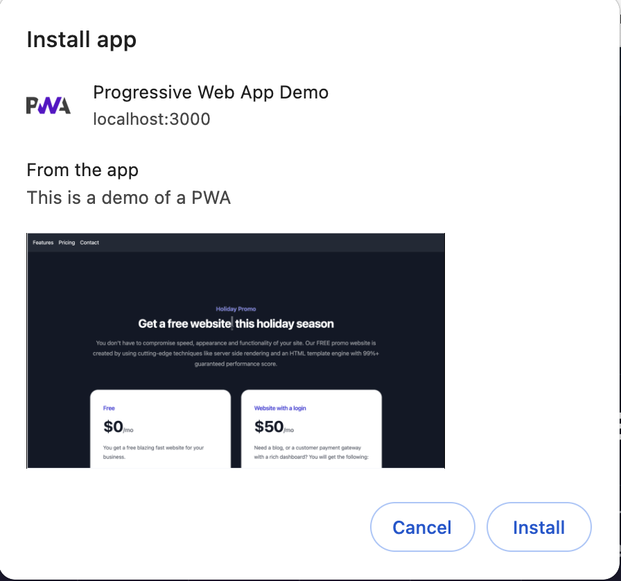

# Progressive Web App Demo

This repository contains a simple Progressive Web App (PWA) demo. The following files are included in the project:

1. **manifest.json** - Contains metadata about the web app.
2. **sw.js** - Service worker script for offline functionality and caching.
3. **script.js** - Main JavaScript file that registers the service worker for the PWA.
4. **styles.css** - CSS file for styling the web app using Tailwind CSS.
5. **index.html** - The main HTML file for the app's structure.

## Demo Screenshot

Here is a screenshot of the demo just before the install:




## Getting Started

To get started with this PWA demo, simply follow these steps:

1. **Clone the repository**:
   ```bash
   git clone https://github.com/dankore/progressive-web-app-demo.git
   cd progressive-web-app-demo
   ```

2. **Install the dependencies**:
   ```bash
   npm install
   ```

3. **Start the development server**:
   ```bash
   npm start
   ```

4. **Open your browser and navigate to** `http://localhost:3000` to view the demo.

## Features

- Offline support using a service worker
- Metadata provided by `manifest.json`
- Simple and clean design with `Tailwind CSS`. Set up not included.

## How to Use

1. **Clone the repository**:
   ```bash
   git clone https://github.com/dankore/progressive-web-app-demo.git
   ```
2. **Navigate to the project directory**:
   ```bash
   cd progressive-web-app-demo
   ```
3. **Install the dependencies**:
   ```bash
   npm install
   ```
4. **Start the development server**:
   ```bash
   npm start
   ```
5. **Open your browser and navigate to** `http://localhost:3000` to view the demo.

